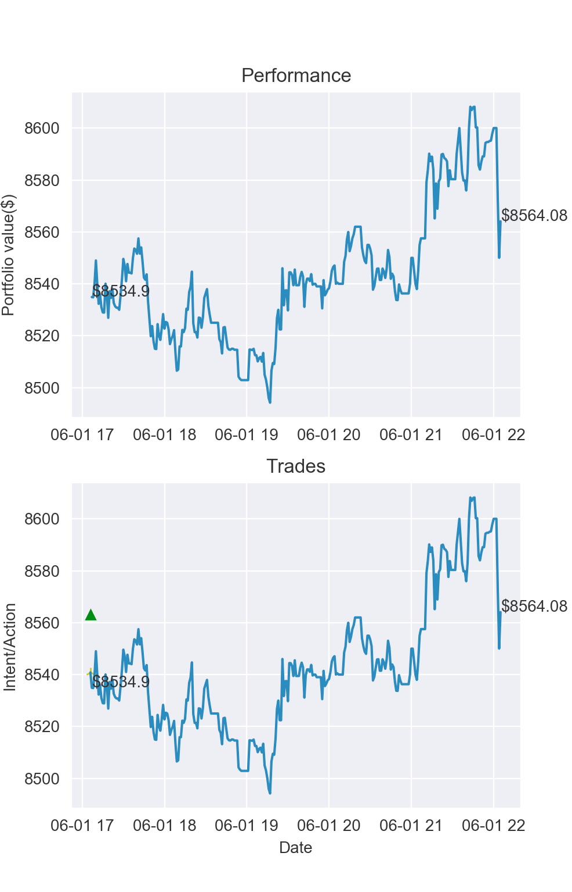

# AAT
AsyncAlgoTrading

[](https://travis-ci.org/timkpaine/aat)
[](https://codecov.io/gh/timkpaine/aat)
[](https://bettercodehub.com/)
[](https://pypi.python.org/pypi/aat)
[](https://pypi.python.org/pypi/aat)
[](http://aat.readthedocs.io/en/latest/)
 
`aat` is a framework for writing algorithmic trading strategies in python. It is designed to be modular and extensible, and is the core engine powering [AlgoCoin](https://github.com/timkpaine/algo-coin).

It comes with support for live trading across (and between) multiple exchanges, fully integrated backtesting support, slippage and transaction cost modeling, and robust reporting and risk mitigation through manual and programatic algorithm controls.

Like Zipline, the inspriation for this system, `aat` exposes a single strategy class which is utilized for both live trading and backtesting. The strategy class is simple enough to write and test algorithms quickly, but extensible enough to allow for complex slippage and transaction cost modeling, as well as mid- and post- trade analysis.  


# Overview
`aat` is composed of 4 major parts. 

- trading engine
- risk management engine
- execution engine
- backtest engine

## Trading Engine
The trading engine initializes all exchanges and strategies, then martials data, trade requests, and trade responses between the strategy, risk, execution, and exchange objects, while keeping track of high-level statistics on the system

## Risk Management Engine
The risk management engine enforces trading limits, making sure that stategies are limited to certain risk profiles. It can modify or remove trade requests prior to execution depending on user preferences and outstanding positions and orders.

## Execution engine
The execution engine is a simple passthrough to the underlying exchanges. It provides a unified interface for creating various types of orders.

## Backtest engine
The backtest engine provides the ability to run the same stragegy offline against historical data.


# Trading Strategy
The core element of `aat` is the trading strategy interface. It is the union of the `Strategy` interface, which provides methods to buy and sell, with the `Callback` interface, which provides callbacks in response to data. Users subclass this class in order to implement their strategies

## Callback
```python3
class Callback(metaclass=ABCMeta):
    @abstractmethod
    def onTrade(self, data: MarketData):
        '''onTrade'''

    @abstractmethod
    def onOpen(self, data: MarketData):
        '''onOpen'''

    @abstractmethod
    def onFill(self, resp: TradeResponse):
        '''onFill'''

    @abstractmethod
    def onCancel(self, data: MarketData):
        '''onCancel'''

    @abstractmethod
    def onChange(self, data: MarketData):
        '''onChange'''

    @abstractmethod
    def onError(self, data: MarketData):
        '''onError'''
```

## Strategy
```python3
class Strategy(metaclass=ABCMeta):
    @abstractmethod
    def requestBuy(self,
                   callback: Callback,
                   data: MarketData):
        '''requestBuy'''

    @abstractmethod
    def requestSell(self,
                    callback: Callback,
                    data: MarketData):
        '''requestSell'''
```

## Example Strategy
Here is a simple trading strategy that buys once and holds. 

```python3
from aat.strategy import TradingStrategy
from aat.structs import MarketData, TradeRequest, TradeResponse
from aat.enums import Side, OrderType
from aat.logging import STRAT as slog, ERROR as elog

class BuyAndHoldStrategy(TradingStrategy):
    def __init__(self) -> None:
        super(BuyAndHoldStrategy, self).__init__()
        self.bought = None

    def onFill(self, res: TradeResponse) -> None:
        self.bought = res
        log.info('d->g:bought %.2f @ %.2f' % (res.volume, res.price))

    def onTrade(self, data: MarketData) -> bool:
        if self.bought is None:
            req = TradeRequest(side=Side.BUY,
                               volume=1,
                               instrument=data.instrument,
                               order_type=OrderType.MARKET,
                               exchange=data.exchange,
                               price=data.price,
                               time=data.time)
            log.info("requesting buy : %s", req)
            self.requestBuy(req)
            self.bought = 'pending'
    def onError(self, e) -> None:
        elog.critical(e)

    def onChange(self, data: MarketData) -> None:
        pass

    def onCancel(self, data: MarketData) -> None:
        pass

    def onOpen(self, data: MarketData) -> None:
        pass
```

Trading strategies have a number of required methods for handling messages:

- onTrade: Called when a trade occurs
- onChange: Called when an order is modified
- onFill: Called when a strategy's trade executes
- onCancel: Called when an order is cancelled
- onError: Called when an error occurs
- onOpen: Called when a new order occurs

There are other optional callbacks for more granular processing:
- onStart: Called when the program starts
- onHalt: Called when trading is halted
- onContinue: Called when trading continues
- onExit: Called when the program shuts down

There are also several optional callbacks for backtesting:

- slippage
- transactionCost
- onAnalyze
    - called after trading engine has processed all data, used to visualize algorithm performance

# Setting up and running
An instance of `TradingStrategy` class is able to run live or against a set of historical trade/quote data. When instantiating a `TradingEngine` object with a `TradingEngineConfig` object, the `TradingEngineConfig` has a `type` which can be set to:

- `live` - live trading against the exchange
- `simulation` - live trading against the exchange, but with order entry disabled
- `sandbox` - live trading against the exchange's sandbox instance
- `backtest` - offline trading against historical OHLCV data

To test our strategy in any mode, we will need to setup exchange keys to get historical data, stream market data, and make new orders.

## API Keys
You should creat API keys for exchanges you wish to trade on. For this example, we will assume a Coinbase Pro account with trading enabled. I usually put my keys in a set of shell scripts that are gitignored, so I don't post anything by accident. My scripts look something like:

```bash
export COINBASE_API_KEY=...
export COINBASE_API_SECRET=...
export COINBASE_API_PASS=...
```

Prior to running, I source the keys I need. 

### Sandboxes
Currently only the Gemini sandbox is supported, the other exchanges have discontinued theirs. To run in sandbox, set `TradingEngineConfig.type` to Sandbox.

### Live Trading
When you want to run live, set `TradingEngineConfig.type` to Live. You will want to become familiar with the risk and execution engines, as these control things like max drawdown, max risk accrual, execution eagerness, etc.

### Simulation Trading
When you want to run an algorithm live, but don't yet trust that it can make money, set `TradingEngineConfig.type` to simulation. This will let it run against real money, but disallow order entry. You can then set things like slippage and transaction costs as you would in a backtest.

## Testing
Let's make sure everything worked out by running a sample strategy (that doesnt make and trades!) on the Coinbase Pro exchange:

```bash
python3 -m algocoin --simulation --exchanges=coinbase
```

You should see the following output:

```bash
python3 -m algocoin --simulation --exchanges=coinbase
2019-06-01 17:54:17,468 CRITICAL -- MainProcess parser.py:151 --
2019-06-01 17:54:17,469 CRITICAL -- MainProcess parser.py:152 -- Simulation trading
2019-06-01 17:54:17,469 CRITICAL -- MainProcess parser.py:153 --
2019-06-01 17:54:34,570 CRITICAL -- MainProcess trading.py:194 --
2019-06-01 17:54:34,570 CRITICAL -- MainProcess trading.py:195 -- Server listening on port: 8081
2019-06-01 17:54:34,571 CRITICAL -- MainProcess trading.py:196 --
2019-06-01 17:54:34,998 CRITICAL -- MainProcess market_data.py:68 -- Starting algo trading: ExchangeType.COINBASE
```

## Config
Because there are a variety of options, a config file is generally more usable. Here is an example configuration for backtesting the Buy-and-hold strategy above on CoinbasePro:

```bash
> cat backtest.cfg
[general]
verbose=1
print=0
TradingType=backtest

[exchange]
exchanges=coinbase
currency_pairs=BTC/USD

[strategy]
strategies =
    aat.strategies.buy_and_hold.BuyAndHoldStrategy

[risk]
max_drawdown = 100.0
max_risk = 100.0
total_funds = 10.0
```

## Analyzing an algorithm
We can run the above config by running:
```bash
python3 -m algocoin --config=./backtest.cfg
```

We should see the following output:
```bash
2019-06-01 17:58:40,173 INFO -- MainProcess utils.py:247 -- running in verbose mode!
2019-06-01 17:58:40,174 CRITICAL -- MainProcess parser.py:165 --
2019-06-01 17:58:40,174 CRITICAL -- MainProcess parser.py:166 -- Backtesting
2019-06-01 17:58:40,174 CRITICAL -- MainProcess parser.py:167 --
2019-06-01 17:58:40,176 CRITICAL -- MainProcess trading.py:106 -- Registering strategy: <class 'aat.strategies.buy_and_hold.BuyAndHoldStrategy'>
2019-06-01 17:58:40,177 INFO -- MainProcess backtest.py:25 -- Starting....
2019-06-01 17:58:41,338 INFO -- MainProcess buy_and_hold.py:28 -- requesting buy : <BTC/USD-Side.BUY:1.0@8567.06-OrderType.MARKET-ExchangeType.COINBASE>
2019-06-01 17:58:41,339 INFO -- MainProcess risk.py:59 -- Requesting 1.000000 @ 8567.060000
2019-06-01 17:58:41,339 INFO -- MainProcess risk.py:80 -- Risk check passed for partial order: <BTC/USD-Side.BUY:1.0@8567.06-OrderType.MARKET-ExchangeType.COINBASE>
2019-06-01 17:58:41,339 INFO -- MainProcess trading.py:244 -- Risk check passed
2019-06-01 17:58:41,339 INFO -- MainProcess trading.py:292 -- Slippage BT- <BTC/USD-Side.BUY:1.0@8567.916706-TradeResult.FILLED-ExchangeType.COINBASE>
2019-06-01 17:58:41,340 INFO -- MainProcess trading.py:295 -- TXN cost BT- <BTC/USD-Side.BUY:1.0@8589.336497765-TradeResult.FILLED-ExchangeType.COINBASE>
2019-06-01 17:58:41,340 INFO -- MainProcess buy_and_hold.py:14 -- d->g:bought 1.00 @ 8589.34
2019-06-01 17:58:41,340 INFO -- MainProcess backtest.py:42 -- <BTC/USD-1.29050038@8567.06-TickType.TRADE-ExchangeType.COINBASE>
...
2019-06-01 17:58:41,474 INFO -- MainProcess backtest.py:42 -- <BTC/USD-2.35773043@8595.0-TickType.TRADE-ExchangeType.COINBASE>
2019-06-01 17:58:41,474 INFO -- MainProcess backtest.py:33 -- Backtest done, running analysis.
```

This will call our `onAnalyze` function, which in this case is implemented to plot some performance characteristics with `matplotlib`.

```python3
        import pandas
        import numpy as np
        import matplotlib, matplotlib.pyplot as plt
        import seaborn as sns
        matplotlib.rc('font', **{'size': 5})

        # extract data from trading engine
        portfolio_value = engine.portfolio_value()
        requests = engine.query().query_tradereqs()
        responses = engine.query().query_traderesps()
        trades = pandas.DataFrame([{'time': x.time, 'price': x.price} for x in engine.query().query_trades(instrument=requests[0].instrument, page=None)])
        trades.set_index(['time'], inplace=True)

        # format into pandas
        pd = pandas.DataFrame(portfolio_value, columns=['time', 'value', 'pnl'])
        pd.set_index(['time'], inplace=True)

        # setup charting
        sns.set_style('darkgrid')
        fig = plt.figure()
        ax1 = fig.add_subplot(311)
        ax2 = fig.add_subplot(312)
        ax3 = fig.add_subplot(313)

        # plot algo performance
        pd.plot(ax=ax1, y=['value'], legend=False, fontsize=5, rot=0)

        # plot up/down chart
        pd['pos'] = pd['pnl']
        pd['neg'] = pd['pnl']
        pd['pos'][pd['pos'] <= 0] = np.nan
        pd['neg'][pd['neg'] > 0] = np.nan
        pd.plot(ax=ax2, y=['pos', 'neg'], kind='area', stacked=False, color=['green', 'red'], legend=False, linewidth=0, fontsize=5, rot=0)

        # annotate with key data
        ax1.set_title('Performance')
        ax1.set_ylabel('Portfolio value($)')
        for xy in [portfolio_value[0][:2]] + [portfolio_value[-1][:2]]:
            ax1.annotate('$%s' % xy[1], xy=xy, textcoords='data')
            ax3.annotate('$%s' % xy[1], xy=xy, textcoords='data')

        # plot trade intent/trade action
        ax3.set_ylabel('Intent/Action')
        ax3.set_xlabel('Date')

        ax3.plot(trades)
        ax3.plot([x.time for x in requests if x.side == Side.BUY],
                 [x.price for x in requests if x.side == Side.BUY],
                 '2', color='y')
        ax3.plot([x.time for x in requests if x.side == Side.SELL],
                 [x.price for x in requests if x.side == Side.SELL],
                 '1', color='y')
        ax3.plot([x.time for x in responses if x.side == Side.BUY],  # FIXME
                 [x.price for x in responses if x.side == Side.BUY],
                 '^', color='g')
        ax3.plot([x.time for x in responses if x.side == Side.SELL],  # FIXME
                 [x.price for x in responses if x.side == Side.SELL],
                 'v', color='r')

        # set same limits
        y_bot, y_top = ax1.get_ylim()
        x_bot, x_top = ax1.get_xlim()
        ax3.set_ylim(y_bot, y_top)
        ax1.set_xlim(x_bot, x_top)
        ax2.set_xlim(x_bot, x_top)
        ax3.set_xlim(x_bot, x_top)
        dif = (x_top-x_bot)*.01
        ax1.set_xlim(x_bot-dif, x_top+dif)
        ax2.set_xlim(x_bot-dif, x_top+dif)
        ax3.set_xlim(x_bot-dif, x_top+dif)
        plt.show()
```

[]()


We can see that our algorithm also implemented `slippage` and `transactionCost`, resulting in a worse execution price:

```python3
    def slippage(self, resp: TradeResponse) -> TradeResponse:
        slippage = resp.price * .0001  # .01% price impact
        if resp.side == Side.BUY:
            # price moves against (up)
            resp.slippage = slippage
            resp.price += slippage
        else:
            # price moves against (down)
            resp.slippage = -slippage
            resp.price -= slippage
        return resp

    def transactionCost(self, resp: TradeResponse) -> TradeResponse:
        txncost = resp.price * resp.volume * .0025  # gdax is 0.0025 max fee
        if resp.side == Side.BUY:
            # price moves against (up)
            resp.transaction_cost = txncost
            resp.price += txncost
        else:
            # price moves against (down)
            resp.transaction_cost = -txncost
            resp.price -= txncost
        return resp
```

# Extending
Apart from writing new strategies, this library can be extended by adding new exchanges. These are pretty simple. For cryptocurrency exchanges, I rely heavily on `ccxt`, `asyncio`, and websocket libraries.

## Example
Here is the coinbase exchange. Most of the code is to manage different websocket subscription options, and to convert between `aat`, `ccxt` and exchange-specific formatting of things like symbols, order types, etc. 

```python3
class CoinbaseExchange(Exchange):
    @lru_cache(None)
    def subscription(self):
        return [json.dumps({"type": "subscribe", "product_id": x.value[0].value + '-' + x.value[1].value}) for x in self.options().currency_pairs]

    @lru_cache(None)
    def heartbeat(self):
        return json.dumps({"type": "heartbeat", "on": True})

    def tickToData(self, jsn: dict) -> MarketData:
        '''convert a jsn tick off the websocket to a MarketData struct'''
        if jsn.get('type') == 'received':
            return

        s = jsn.get('type').upper()
        reason = jsn.get('reason', '').upper()
        if s == 'MATCH' or (s == 'DONE' and reason == 'FILLED'):
            typ = TickType.TRADE
        elif s in ('OPEN', 'DONE', 'CHANGE', 'HEARTBEAT'):
            if reason == 'CANCELED':
                typ = TickType.CANCEL
            elif s == 'DONE':
                typ = TickType.FILL
            else:
                typ = TickType_from_string(s.upper())
        else:
            typ = TickType.ERROR

        order_id = jsn.get('order_id', jsn.get('maker_order_id', ''))
        time = parse_date(jsn.get('time')) if jsn.get('time') else datetime.now()

        if typ in (TickType.CANCEL, TickType.OPEN):
            volume = float(jsn.get('remaining_size', 'nan'))
        else:
            volume = float(jsn.get('size', 'nan'))
        price = float(jsn.get('price', 'nan'))

        currency_pair = str_to_currency_pair_type(jsn.get('product_id')) if typ != TickType.ERROR else PairType.NONE

        instrument = Instrument(underlying=currency_pair)

        order_type = str_to_order_type(jsn.get('order_type', ''))
        side = str_to_side(jsn.get('side', ''))
        remaining_volume = float(jsn.get('remaining_size', 0.0))

        sequence = int(jsn.get('sequence', -1))
        ret = MarketData(order_id=order_id,
                         time=time,
                         volume=volume,
                         price=price,
                         type=typ,
                         instrument=instrument,
                         remaining=remaining_volume,
                         side=side,
                         exchange=self.exchange(),
                         order_type=order_type,
                         sequence=sequence)
        return ret
```
